# Full-stack Event Management application

This full-stack Event Management application is developed using ASP.NET, React, Node.js, and Spring Boot, codded in C#, JavaScript, and Java.

## Table Of Content
- [Full-stack Event Management application](#full-stack-event-management-application)
  - [Table Of Content](#table-of-content)
  - [Key Features](#key-features)
  - [Tech Stack Used](#tech-stack-used)
  - [1. Sign-up and Login Module (Backend Endpoints, URLs and Application UI)](#1-sign-up-and-login-module-backend-endpoints-urls-and-application-ui)
    - [Technical Highlights](#technical-highlights)
    - [Application URLs](#application-urls)
    - [Application UI](#application-ui)
  - [2. User Module Features  (Backend Endpoints, URLs and Application UI)](#2-user-module-features--backend-endpoints-urls-and-application-ui)
    - [Technical Highlight](#technical-highlight)
    - [Technical Framework Summary](#technical-framework-summary)
    - [Application URLs](#application-urls-1)
    - [Application UI](#application-ui-1)
  - [3. Admin Module Features (Backend Endpoints, URLs and Application UI)](#3-admin-module-features-backend-endpoints-urls-and-application-ui)
    - [Frontend Functionalities](#frontend-functionalities)
    - [Application URLs](#application-urls-2)
    - [Application UI](#application-ui-2)
  - [SQLite Integration with Spring Boot](#sqlite-integration-with-spring-boot)
  - [ER Diagram](#er-diagram)
    - [Database Schema](#database-schema)
    - [Relationship, Logic and Usage](#relationship-logic-and-usage)
  - [Flow Documentation](#flow-documentation)
    - [1. User Interaction Flow](#1-user-interaction-flow)
    - [2. Admin Interaction Flow](#2-admin-interaction-flow)
  - [Dockerization](#dockerization)
  - [Application Deployment \& Usage Guide](#application-deployment--usage-guide)
    - [**Usage Option 1: Dockerized Deployment**](#usage-option-1-dockerized-deployment)
    - [**Usage Option 2: Manual Deployment**](#usage-option-2-manual-deployment)
    - [**Usage Option 3: Hybrid Deployment**](#usage-option-3-hybrid-deployment)


---

## Key Features

- Streamlined Event Scheduling: The application automates scheduling, integrating vendor bookings, venue management, and notifications into a cohesive workflow
- Optimized Attendee Management: It includes features to handle registrations, guest lists, and automated communication for reminders and updates, ensuring efficient attendee handling.
- Advanced Budget Tracking: The system allows for real-time budget monitoring, expense management, and easy generation of comprehensive financial reports
- Enhanced Customer Engagement: Through its intuitive interface, customers can effortlessly browse event details, make bookings, and stay updated with personalized notifications

---

## Tech Stack Used

This application consists of three modules, including the module for user login and authentication, the User Module and the Admin Module. 

| Component       | Technology               |
|-----------------|--------------------------|
| Frontend        | React, ASP.NET (Razor Pages)                    |
| Backend         | Node.js, ASP.NET, Spring Boot with Maven|
| Database        | SQLite                   |
| Authentication  | JWT with BCrypt hashing  |

 

---


## 1. Sign-up and Login Module (Backend Endpoints, URLs and Application UI)

| **Module**            | **Features**                                                                                                                                                                                                                      | **Backend Endpoints**                                                                                                                                                                                                                                                                                                                                                             |
|-----------------------|-----------------------------------------------------------------------------------------------------------------------------------------------------------------------------------------------------------------------------------|------------------------------------------------------------------------------------------------------------------------------------------------------------------------------------------------------------------------------------------------------------------------------------------------------------------------------------------------------------------------------------|
| **User Signup**       | - Users provide an email and password during signup.<br>- Password is hashed using BCrypt before storage for secure handling.<br>- Duplicate email entries are checked to ensure uniqueness.<br>- Users are redirected to the login page upon successful signup. | **POST /api/auth/signup**<br>- Validates request data, ensuring the email and password are provided.<br>- Checks for existing email in the **Users** table.<br>- Hashes the password using **BCrypt**.<br>- Inserts new user record into **Users** table.<br>- Handles validation and database errors.                                                                                 |
| **User Login**        | - Users log in with registered email and password.<br>- Password is verified using BCrypt.<br>- A JWT token is generated and returned.<br>- Users are redirected to their profile page after login.                              | **POST /api/auth/login**<br>- Queries **Users** table for the provided email.<br>- Verifies password using **BCrypt**.<br>- Generates JWT token with user's email.<br>- Returns token upon success.<br>- Returns error on invalid credentials.                                                                                                                                     |
| **Admin Login**       | - Admins log in with their credentials.<br>- Password is verified using BCrypt.<br>- A JWT token is generated with "Admin" role.<br>- Redirects to admin functionality page after login.                                        | **POST /api/auth/admin-login**<br>- Queries **Admin** table using provided email.<br>- Verifies password using **BCrypt**.<br>- Generates JWT token with role "Admin".<br>- Redirects to admin page.<br>- Handles login failures and errors.                                                                                                                                       |
| **JWT Authentication**| - JWT token is generated during login (User/Admin).<br>- Includes claims: email and role.<br>- Signed with HMAC-SHA256.<br>- Token expires after 2 hours.                                                                         | **Token Generation Function (GenerateJwtToken):**<br>- Embeds claims (email and role).<br>- Uses **SymmetricSecurityKey** for signing.<br>- Adds issuer, audience, and expiration metadata.<br>- Uses **JwtSecurityTokenHandler**.<br>- Supports both User and Admin roles.                                                                                                        |


### Technical Highlights

| **Category**            | **Details** |
|------------------------|------------|
| **Security Implementation** | - Passwords are securely hashed using **BCrypt**, ensuring stored credentials cannot be reversed.<br>- JWT tokens are signed using **HMAC-SHA256** and include embedded claims, ensuring secure and verifiable session handling. |
| **Database Interaction** | - Efficient queries (SELECT, INSERT) are utilized for user and admin authentication processes.<br>- Ensures email uniqueness via HasIndex constraints on the **Users** and **Admin** tables. |
| **Role-Based Access** | - Role-specific claims (User/Admin) are embedded in JWT tokens, enabling differentiation in session functionalities. |
| **Frontend Integration** | - Upon successful login/signup, users are redirected to their respective pages (User Profile or Admin Functionality) seamlessly. |

### Application URLs

| **Pages** | **URL** |
| --- | --- |
| Initial page on opening the application | <http://localhost:5274/Home> |
| User Signup | <http://localhost:5274/UserSignup> |
| User Login | <http://localhost:5274/UserLogin> |
| Admin login | <http://localhost:5274/Admin> |


### Application UI

| Image | Description |
|-------|------------|
| 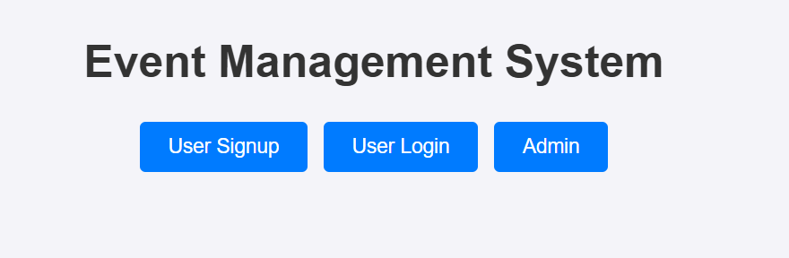 | **Figure 1: Initial page on opening the application** |
| 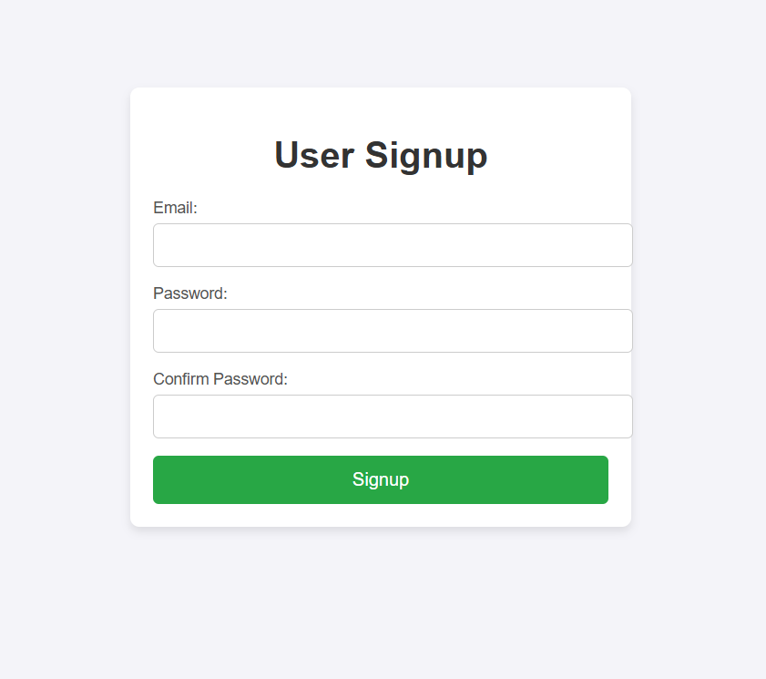 | **Figure 2: User Signup** |
| 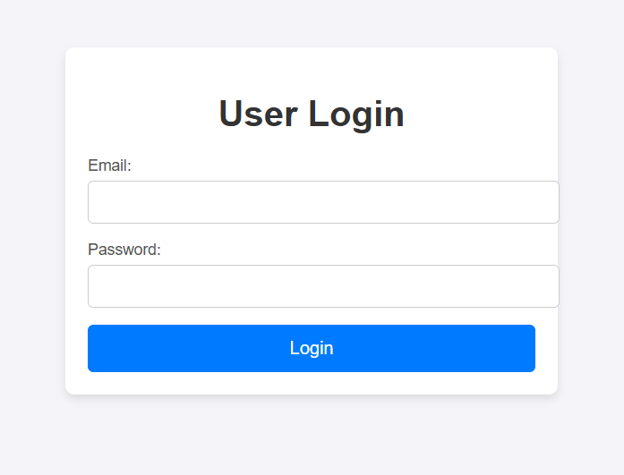 | **Figure 3: User Login** |
| 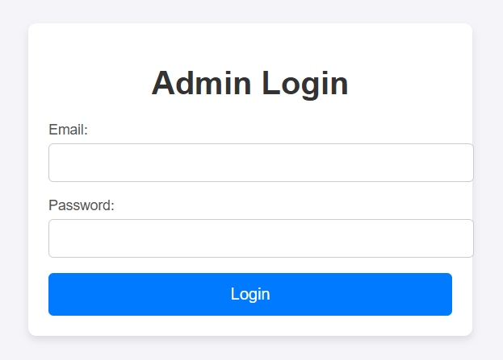 | **Figure 4: Admin login** |
 

---

## 2. User Module Features  (Backend Endpoints, URLs and Application UI)


| **Module**                      | **Features**                                                                                                                                                                                                                                                                                             | **Backend Endpoints**                                                                                                                                                                                                                                                                                                                                                                                                          |
|---------------------------------|----------------------------------------------------------------------------------------------------------------------------------------------------------------------------------------------------------------------------------------------------------------------------------------------------------|---------------------------------------------------------------------------------------------------------------------------------------------------------------------------------------------------------------------------------------------------------------------------------------------------------------------------------------------------------------------------------------------------------------------------------|
| **User Welcome & Profile Management** | - Users are greeted with a personalized message using their stored name.<br>- "Edit Profile" allows users to dynamically update their name.                                                                                                                             | **GET /api/username/:email**<br>- Fetches the username from the **Users** table based on the provided email.<br>- Returns personalized data for greeting and profile.<br><br>**PUT /api/username/:email**<br>- Updates the **Username** field for the specified email.<br>- Validates non-empty input.<br>- Returns success or error based on affected rows.                                                                 |
| **Event Browsing & Venue Viewing**    | - Users can browse a full list of events with key details: name, theme, description, date, time, capacity, price, and venue.<br>- "View Location" uses Google Maps integration to show the venue.                                                                 | **GET /api/events**<br>- SELECT query joins **Events** and **Location** tables using event ID.<br>- Returns event metadata along with latitude and longitude for Google Maps embedding.<br>- Handles DB errors and returns fallback messages if needed.                                                                                                                              |
| **Event Booking & Confirmation**      | - Users can book events via a confirmation window.<br>- Event is added to the user's profile in real time.<br>- Multiple ticket booking is supported, with data reflected instantly after booking or refreshing.                                                   | **POST /api/book-event**<br>- Validates event capacity (max vs current) from **Events** table.<br>- Retrieves user ID from **Users** table using email.<br>- Checks existing bookings in **Booked** table:<br>&nbsp;&nbsp;- If exists: Updates tickets_booked count.<br>&nbsp;&nbsp;- Else: Inserts new booking record.<br>- Updates event's current capacity.<br>- Includes checks for errors and prevents overbooking.       |
| **Event Availability & Restrictions** | - Events with full capacity or undefined venue details are displayed as unavailable.<br>- Such events remain visible for awareness but are restricted from booking.                                                                                              | **POST /api/book-event** (shared logic)<br>- Validates that event has available capacity and defined venue location (latitude/longitude).<br>- Returns an error if event is fully booked or venue is unassigned.<br>- Prevents proceeding to booking step for restricted events.                                                                                                                                            |
| **Tracking Booked Events**           | - Users can view a complete list of their booked events.<br>- Includes event name, date, time, venue, theme, and number of tickets.<br>- Booking data persists and is retrieved after login.                                                                      | **GET /api/booked-events/:email**<br>- Complex JOIN query on **Booked**, **Events**, **Location**, and **Users** tables.<br>- Filters on user email.<br>- Returns a detailed JSON of all booked events for rendering in user profile.<br>- Ensures that data integrity is maintained across login sessions.                                                                                                                  |


### Technical Highlight

| **Category**            | **Details** |
|------------------------|------------|
| **Input Validation** | - Each endpoint includes input validation for user-provided data.<br>- Example: Checking if username is empty in `PUT /api/username/:email` or ensuring valid `eventId` in `POST /api/book-event`. |
| **Error Handling** | - Robust error handling ensures that database errors, invalid inputs, or unforeseen issues are gracefully managed.<br>- Meaningful HTTP response codes are used (e.g., `404 Not Found`, `400 Bad Request`, `500 Internal Server Error`). |
| **Dynamic Updates** | - Real-time updates for event capacities.<br>- User bookings enhancing the seamlessness of the application workflow. |

### Technical Framework Summary

| **Category**            | **Details** |
|------------------------|------------|
| **Frontend** | - React ensures an interactive and responsive user interface.<br>- Features include personalized greetings, event browsing, filtering, and booking. |
| **Backend** | - Express facilitates robust API endpoints.<br>- Connects the frontend with the SQLite database for real-time data fetching and updates. |
| **Database Operations** | - SQLite handles efficient storage and retrieval of user, event, and booking data.<br>- Operations include `SELECT` (retrieving data), `INSERT` (new records), and `UPDATE` (modifying existing records) for synchronized functionality. |


### Application URLs

| **Pages** | **URL** |
| --- | --- |
| **\*** User Profile  <br>(Different for different users) | <http://localhost:5173/email?user=saahen1@gmail.com> |

User profile is separate for each user like  
[http://localhost:5173/email?user=](http://localhost:5173/email?user=saahen1@gmail.com)Email

Email is the user email given during the time of signup.


### Application UI


| Image | Description |
|-------|------------|
| 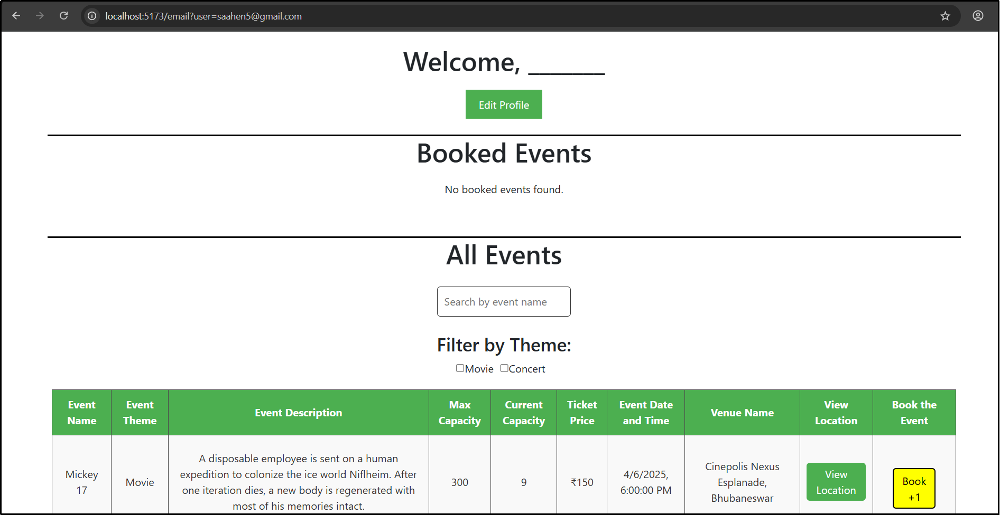 | **Figure 5: Page a new user sees.** |
| 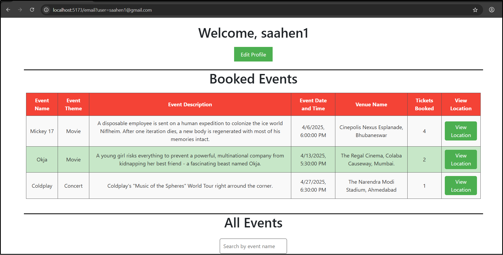 | **Figure 6: Page after editing profile, changing names, and booking events.** |
| 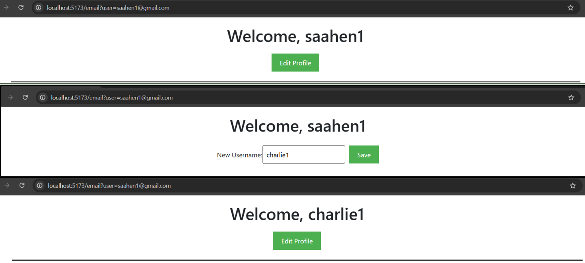 | **Figure 7: Images showing edit user profile functionality.** |
| 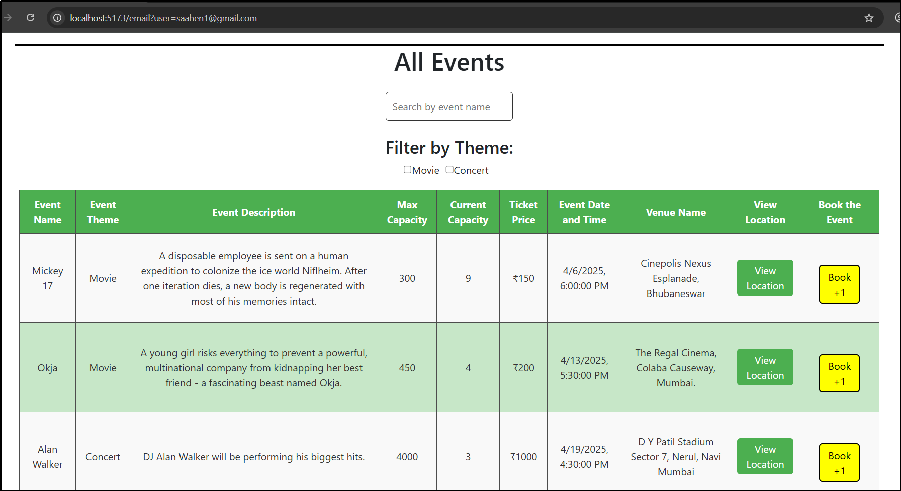 | **Figure 8: Images showing a list of all available events.** |
| 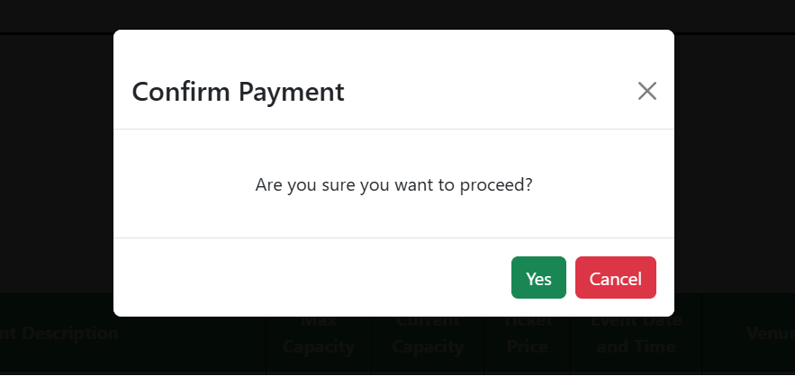 | **Figure 9: Images showing a dialogue box for payment confirmation for event booking.** |
| 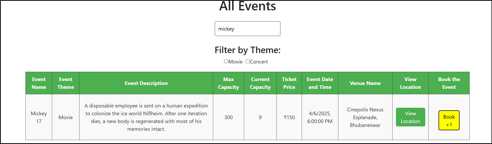 | **Figure 10: Images showing search by event feature.** |
| 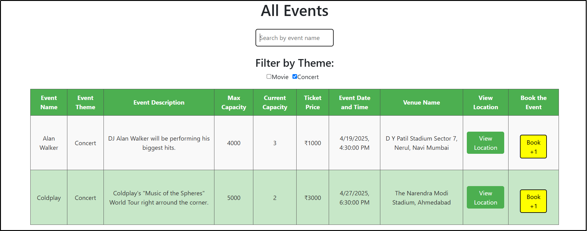 | **Figure 11: Images showing filter by theme feature.** |

---

## 3. Admin Module Features (Backend Endpoints, URLs and Application UI)

| **Module** | **Features** | **Backend Endpoint(s)** |
|-------------|--------------------|--------------------------|
| **Create New Event** | - Admin creates events by entering name, description, theme, date, time, capacity, and ticket price via a form.<br>- Created events are shown in both admin and user dashboards. | **POST /api/events**<br>• Validates required fields (e.g., name, max_capacity, ticket_price, event_datetime).<br>• Inserts data into `Events` table.<br>• Returns new event ID with error handling. |
| **Edit Event Details** | - Admin can modify existing event info via "Edit" button.<br>- Changes reflect dynamically across all dashboards. | **PUT /api/events/:id**<br>• Updates fields in `Events` table (e.g., name, theme, datetime, etc.).<br>• Simultaneously updates related venue info in `Location` table.<br>• Includes relational checks and error handling. |
| **Venue Management** | - Admin assigns venues to events.<br>- Venue details include name and coordinates for map integration.<br>- Edits are reflected system-wide. | **PUT /api/venues/:id**<br>• Updates venue_name, latitude, and longitude in `Location` table.<br>• Validates input and ensures event-venue linkage.<br>• Handles input errors and relational integrity. |
| **Dashboard Metrics** | - Admin sees metrics: total/average income, capacity % per event.<br>- Events filterable by theme or search bar.<br>- Admin views attendee details and sends reminders. | **GET /getevents**<br>• Fetches event data for metric calculations.<br>**GET /getbooked**<br>• Retrieves attendee details by `event_id`.<br>• Reminder emails triggered through confirmation modal. |

### Frontend Functionalities

| **Feature**                    | **Details** |
|---------------------------------|------------|
| **Create Event** | - Admins use a form to enter event details such as name, theme, description, date, and capacity.<br>- React handles form submission and sends data via `POST` requests to the backend. |
| **Edit Event and Venue** | - Event and venue details are editable using "Edit" buttons, dynamically updating fields based on admin input.<br>- Frontend sends `PUT` requests to backend endpoints to persist changes. |
| **Revenue and Metrics Dashboard** | - The admin dashboard calculates metrics like total revenue, average income, and availability percentage using React state variables and backend API responses.<br>- Filtering is implemented with search bars and checkboxes. |
| **Attendee Tracking and Reminder** | - Admins input event IDs to view attendee lists and booking details.<br>- Clicking "Send Reminder" triggers a modal confirmation window, where reminders are sent to attendees via email using backend logic. |

### Application URLs

| **Pages** | **URL** |
| --- | --- |
| Admin’s Event and Venue management page | <http://localhost:5174/admindashboard> |
| Admin’s vendor and Attendee Management page | <http://localhost:5174/vendor-att> |


### Application UI

| Image | Description |
|-------|------------|
| 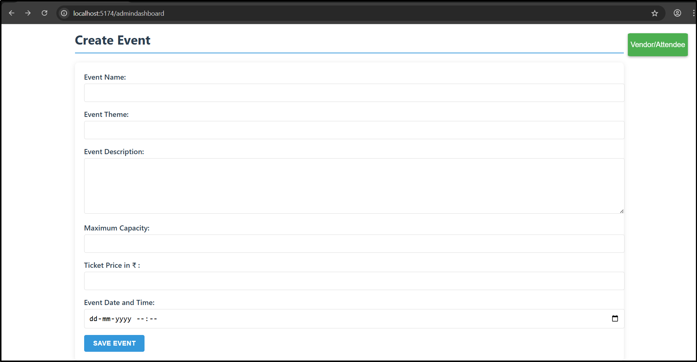 | **Figure 12: Create Event Form.** |
| 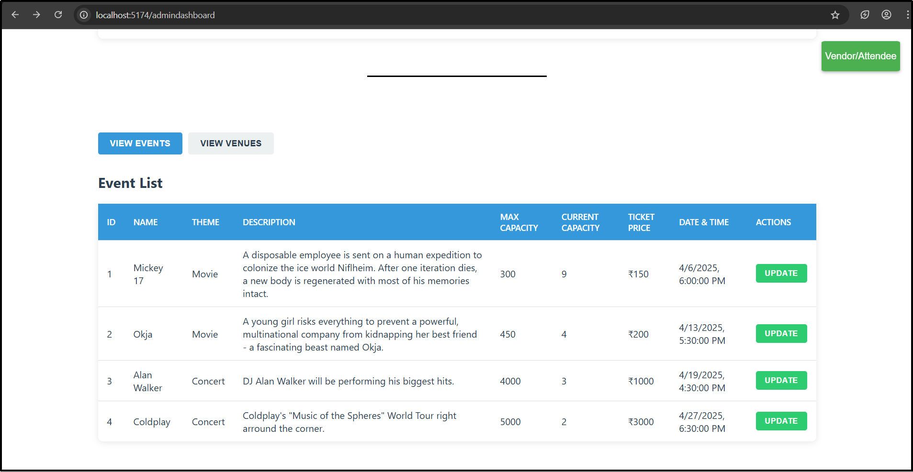 | **Figure 13: Event list table.** |
| 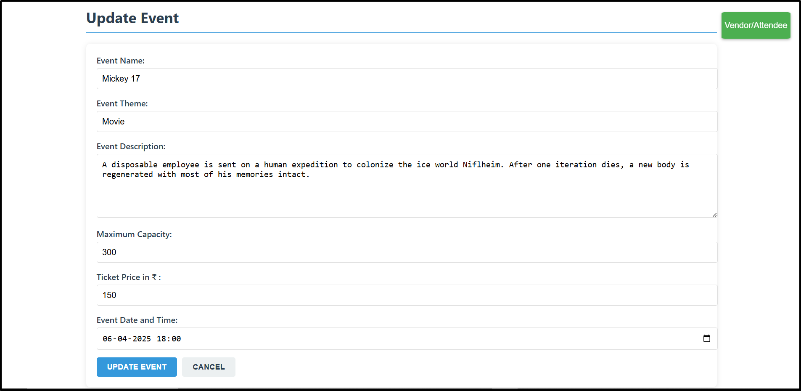 | **Figure 14: Event form loaded with event data to be edited.** |
| 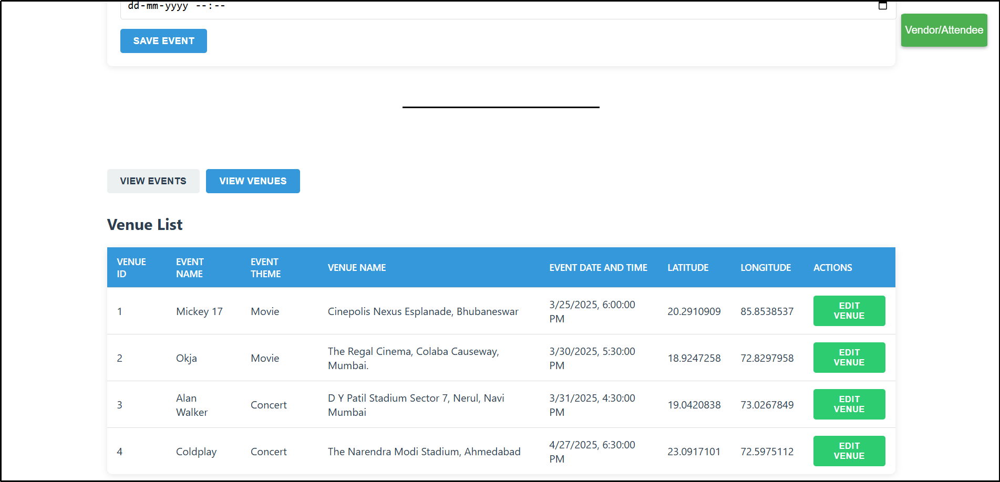 | **Figure 15: Venue list table.** |
| 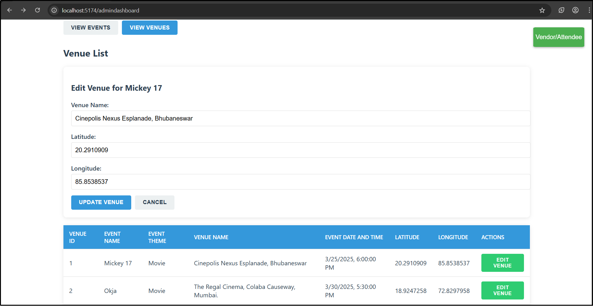 | **Figure 16: Venue list table with edit venue form.** |
| 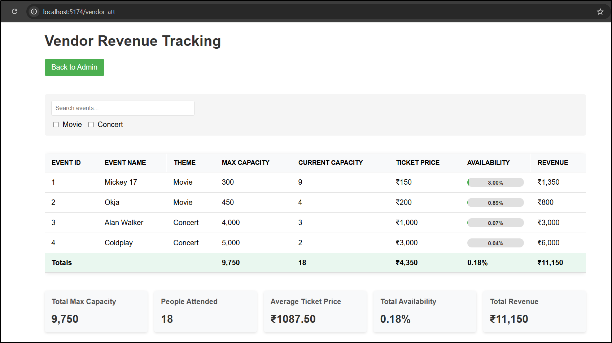 | **Figure 17: Vendor Dashboard.** |
| 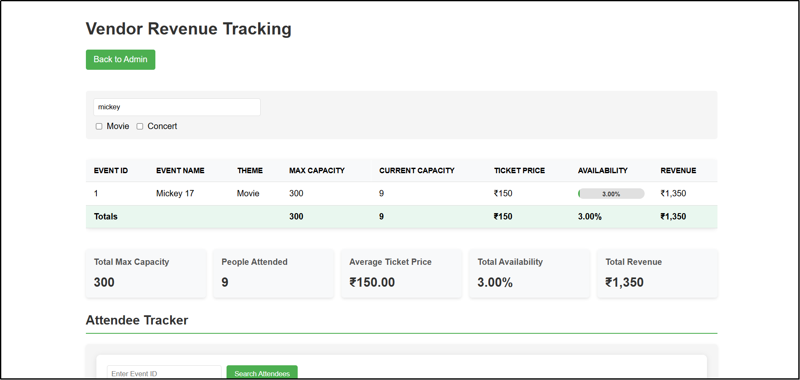 | **Figure 18: Vendor Dashboard’s search event by name functionality.** |
| 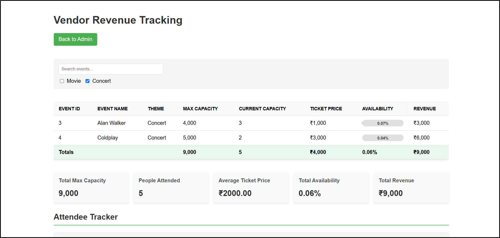 | **Figure 19: Vendor Dashboard’s filter by theme functionality.** |
| 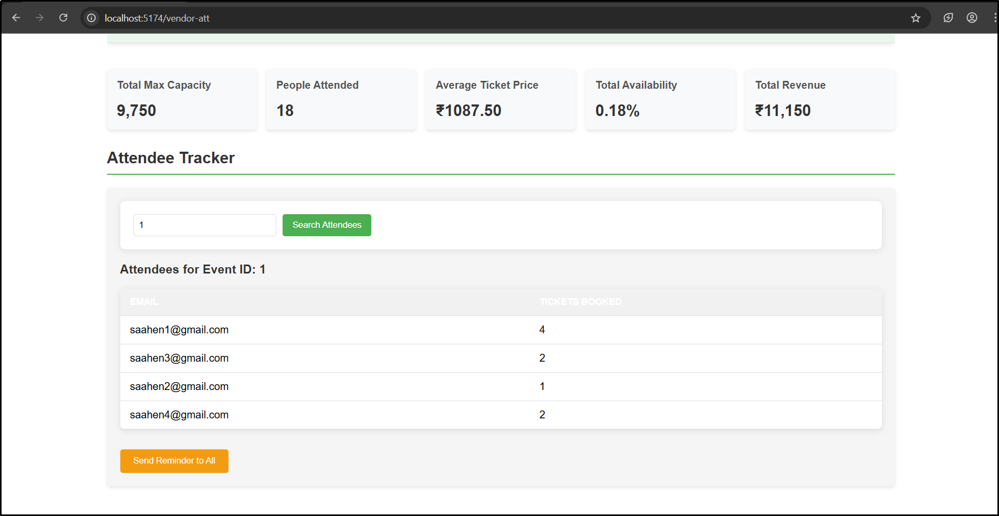 | **Figure 20: Attendee management Tracker list.** |
| 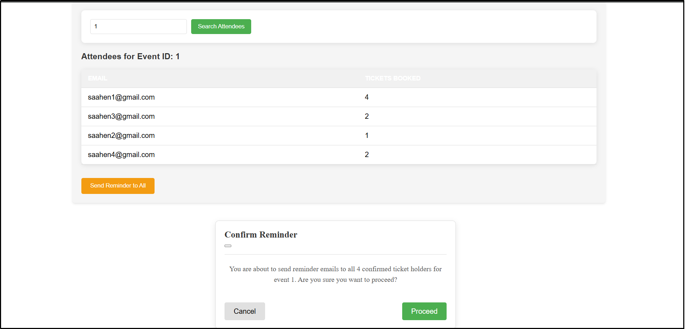 | **Figure 21: Attendee management Tracker list’s email reminder dialogue box.** |

---

## SQLite Integration with Spring Boot 

SQLite integration with Spring Boot necessitated the implementation of custom dialects and entity mappings due to SQLite's limited compatibility with Spring's JPA. To handle this, the following steps were taken:


| **Feature** | **Details** |
|------------|------------|
| **Custom Dialects** | - A custom SQLite dialect was created to enable seamless communication between the Spring Boot application and the SQLite database.<br>- Overcomes limitations in handling constraints and field types. |
| **Service Layers** | - Services such as `EventService` and `BookedService` fetch, process, and transform entity data into DTOs (Data Transfer Objects).<br>- Facilitates efficient frontend communication via APIs. |
| **Entity and Repository Management** | - Entities were explicitly mapped to database tables using `@EntityScan` annotations.<br>- Repositories (`EventRepository`, `BookedRepository`) encapsulate database operations like `findAll`, `save`, and `update`. |
| **Frontend-Backend Communication** | - React fetches parsed values from the Spring Boot backend running on `<http://localhost:8080>`.<br>- API responses dynamically render metrics, attendee data, and venue details on the admin page. |

---

## ER Diagram  

### Database Schema

| **Table Name**  | **Attribute**       | **Properties** |
|----------------|--------------------|---------------|
| **Admin**      | Id                 | Integer, primary key, auto-incremented. Unique identifier for each admin. |
|                | Email              | Text, unique, not null. Stores the admin's email address. |
|                | Password           | Text, not null. Stores the admin's password. |
| **Users**      | Id                 | Integer, primary key, auto-incremented. Unique identifier for each user. |
|                | Email              | Text, not null. Stores the user's email address. |
|                | Password           | Text, not null. Stores the user's password. |
|                | Username           | Text, default value `___`. Stores the user's display name. |
| **Events**     | eventid            | Integer, primary key, auto-incremented. Unique identifier for each event. |
|                | name               | Text, not null. Stores the name of the event. |
|                | theme              | Text. Stores the theme of the event. |
|                | description        | Text. Stores details about the event. |
|                | max_capacity       | Integer, not null. Maximum attendees the event can accommodate. |
|                | current_capacity   | Integer, default value 0. Tracks the current number of attendees. |
|                | ticket_price       | Integer, not null. Stores the ticket price for the event. |
|                | event_datetime     | Datetime, not null. Records the scheduled date and time for the event. |
| **Booked**     | id                 | Integer, primary key, auto-incremented. Unique identifier for each booking. |
|                | useremail_id       | Integer, foreign key referencing `Users.Id`, on delete cascade. Links the booking to the user who made it. |
|                | event_booked       | Integer, foreign key referencing `Events.eventid`, on delete cascade. Links the booking to a specific event. |
|                | tickets_booked     | Integer, not null, default value 1. Records the number of tickets booked. |
|                | Email              | Text. Stores the email address associated with the booking. |
| **Location**   | venueid            | Integer, primary key, auto-incremented. Unique identifier for each venue. |
|                | event_name         | Varchar(255). Stores the name of the event hosted at the venue. |
|                | event_theme        | Varchar(255). Stores the theme of the event hosted at the venue. |
|                | venue_name         | Varchar(255), default value `'unassigned'`. Stores the venue name. |
|                | event_datetime     | Datetime. Records the date and time of the event at the venue. |
|                | longitude          | Real, default value `0.000000`. Geographical longitude of the venue. |
|                | latitude           | Real, default value `0.000000`. Geographical latitude of the venue. |
|                | eventid            | Integer, foreign key referencing `Events.eventid`. Links the venue to the event. |

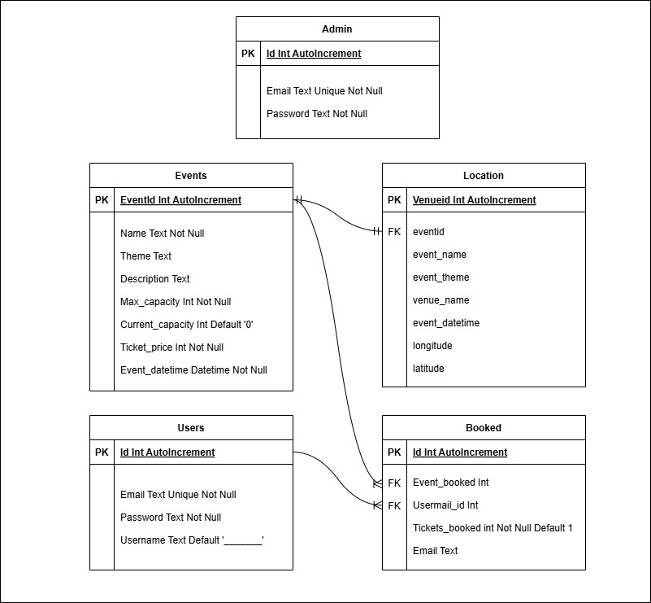  <br> 
**Figure 22: ER Diagram of the application**


### Relationship, Logic and Usage

| **Relationship**        | **Logic** | **Usage** |
|------------------------|---------|----------|
| **Users → Booked (One-to-Many)** | - A user can book multiple events.<br>- Relationship established via `useremail_id` foreign key in `Booked`, referencing `Users.Id`. | - When a user books an event, a new entry is created in `Booked`, linking `useremail_id` and `event_booked`.<br>- Stores the number of tickets (`tickets_booked`) and associated email. |
| **Events → Booked (One-to-Many)** | - An event can have multiple bookings.<br>- Relationship established via `event_booked` foreign key in `Booked`, referencing `Events.eventid`. | - When an event is booked, `current_capacity` in `Events` is updated.<br>- A new row is created in `Booked` linking the event's ID. |
| **Events → Location (One-to-One)** | - Each event is assigned a specific venue.<br>- Relationship established via `eventid` foreign key in `Location`, referencing `Events.eventid`. | - The app associates each event with a venue.<br>- Venue details (name, coordinates, datetime) are stored in the `Location` table. |

---

## Flow Documentation

### 1. User Interaction Flow

| **Feature** | **Action** | **Outcome** | **Endpoint** |
|------------|-----------|------------|-------------|
| **User Signup** | - User visits the signup page and fills in their email and password.<br>- Confirms the password to ensure accuracy. | - Backend validates input and checks for duplicate emails.<br>- Password is hashed using `BCrypt` and stored securely.<br>- User is redirected to the login page. | ```POST /api/auth/signup``` |
| **User Login** | - User enters their email and password and submits the login form. | - Backend verifies credentials.<br>- On success, a JWT token is generated and stored.<br>- User is redirected to their personal dashboard. | ```POST /api/auth/login``` |
| **Browsing Events** | - Users browse the event list on the main dashboard.<br>- Events can be filtered by **name** (search bar) or **theme** (checkboxes). | - Events are displayed with details: name, theme, description, datetime, venue, ticket price, availability. | ```GET /api/events``` |
| **Booking an Event** | - User clicks on the "Book Event" button for a selected event.<br>- A confirmation popup appears to confirm booking. | - On confirmation, event is added to user’s "Confirmed Events".<br>- Multiple tickets can be booked. | ```POST /api/book-event``` |
| **Viewing Booked Events** | - User navigates to their profile page. | - List of booked events is displayed with name, theme, date, venue, and number of tickets. | ```GET /api/booked-events/:email``` |


### 2. Admin Interaction Flow

| **Feature** | **Action** | **Outcome** | **Endpoint** |
|------------|-----------|------------|-------------|
| **Admin Login** | - Admin provides credentials on the login page. | - JWT token is generated upon successful login.<br>- Admin is redirected to the dashboard. | ```POST /api/auth/admin-login``` |
| **Creating New Events** | - Admin fills a form to create an event with name, description, theme, datetime, capacity, and price. | - Event is saved and visible in both admin and user dashboards. | ```POST /api/events``` |
| **Editing Events** | - Admin clicks "Edit" beside an event and modifies details. | - Database is updated and UI reflects changes dynamically. | ```PUT /api/events/:id``` |
| **Venue Management** | - Admin assigns or edits venue details (place name and coordinates). | - Venue updates are reflected in the linked `Location` table. | ```PUT /api/venues/:id``` |
| **Vendor & Attendee Dashboard** | - Admin views revenue, ticket stats, and capacity usage.<br>- Can search events and view attendee details. | - Metrics and attendee information are dynamically shown.<br>- Email reminders can be sent to attendees. | - Fetch metrics: ```GET /getevents```<br>- Fetch attendee list: ```GET /getbooked```<br>- Email reminder logic is triggered via confirmation modal. |

---

## Dockerization

| **Service**       | **Purpose** | **Features** |
|------------------|------------|-------------|
| **ASP.NET Core (`asp`)** | Hosts ASP.NET backend. | - Uses `mcr.microsoft.com/dotnet/sdk` for build.<br>- Publishes to a lightweight runtime image.<br>- Exposes port `5274`. |
| **React User Interface (`react`)** | Hosts the frontend user interface. | - Installs Node.js dependencies, copies source, sets environment.<br>- Exposes ports `5173` (frontend) and `3001` (backend). |
| **React Admin Interface (`react-admin`)** | Admin-facing frontend. | - Exposes ports `5174` (frontend) and `3002` (backend). |
| **Spring Boot Backend (`spring`)** | Hosts admin functionality. | - Uses Maven with SQLite integration.<br>- Exposes port `8080`. |

**Visual Overview**

| Image | Description |
|-------|------------|
| 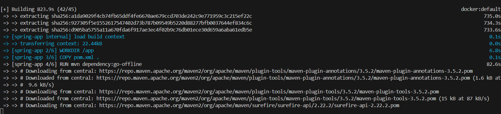 | **Figure 23: Docker Compose build process.** |
| 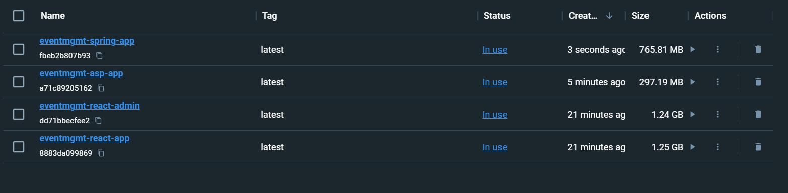 | **Figure 24: Docker images after build (Docker UI).** |
| 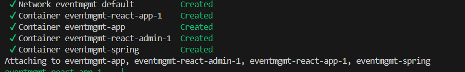 | **Figure 25: Docker images after build (Terminal).** |
| 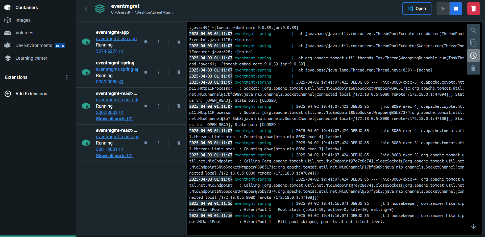 | **Figure 26: Running containers with port mappings.** |

---

## Application Deployment & Usage Guide

### **Usage Option 1: Dockerized Deployment**

- Navigate to the project root:

```bash
docker-compose up --build
```

* Builds and starts:

  * ASP.NET backend
  * Node.js backend
  * Spring Boot backend
  * React UIs

---

### **Usage Option 2: Manual Deployment**

**Terminal 1: ASP.NET**

```bash
cd asp
dotnet run
```

Ensure you update `appsettings.json` connection string to:

```json
"DefaultConnection": "Data Source=../Backend/EventManagement.db"
```

**Terminal 2: React Frontend**

```bash
cd react
npm run dev
```

**Terminal 3: React Backend**

```bash
cd react
node server.js
```

**Terminal 4: React Admin Frontend**

```bash
cd reactadmin
npm run dev
```

**Terminal 5: React Admin Backend**

```bash
cd reactadmin
node server.js
```

**Terminal 6: Spring Boot Backend**

```bash
cd spring
mvn spring-boot:run
```

---

### **Usage Option 3: Hybrid Deployment**

* Build selected images (React, Admin, ASP):

```bash
docker-compose up react-app react-admin asp-app --build
```

* Run Spring Boot manually:

```bash
cd spring
mvn spring-boot:run
```
